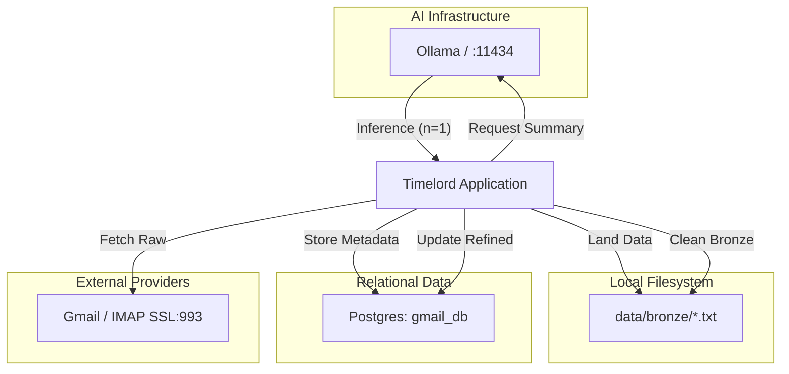

# ⏳ Timelord: Inbox Intelligence Agent

**Timelord** is a production-ready, AI-driven inbox intelligence module. This project is a showcase of **Spec-Oriented Development**, **Domain-Driven Design (DDD)**, and was **authored entirely by an AI Agent** (Antigravity).

---

## 🤖 AI-Agent Native & Spec-Driven
- **Pure AI Authored**: Every line of code, migration, and configuration was autonomously generated and refined by the AI Agent to meet complex spec requirements.
- **Spec-Oriented Development**: Implementation follows a strict **Capability Brief**, ensuring that architectural decisions (Medallion Architecture, Resource Guardrails) align precisely with high-level domain goals.
- **Domain-Driven Design (DDD)**: leverages **Spring Modulith** to enforce strict bounded contexts, event-driven internal communication, and clear port/adapter boundaries.

---

## 🚀 Key Capabilities

- **🔄 Multi-Account Synchronization**: Periodically polls multiple user-defined Gmail accounts via **IMAP/SSL** (using Google App Passwords).
- **🥇 Medallion Data Pipeline**:
    - **Bronze Layer**: Raw email bodies are landed as unique `.txt` files for auditing and persistence.
    - **Silver Layer**: Refined metadata is stored in **PostgreSQL** (schema: `gmail_db`).
    - **Gold Layer**: AI-driven summaries, sentiment analysis, and action items are generated and persisted.
- **🧠 Local AI Summarization**: Powered by **Spring AI** and **Ollama** (`qwen2.5:7b`), ensuring all data processing stays local and private.
- **🛡️ Resource Guardrails**: Strictly sequential AI processing via Semaphore control to prevent local resource exhaustion.
- **📦 Containerized DevOps**: Fully Dockerized with multi-stage builds and easy deployment scripts (default port: `3017`).
- **🧩 Spring Modulith Architecture**: Built on a decoupled, event-driven internal architecture for high maintainability and testability.

---

## 🗺️ Roadmap & Upcoming Features
- **🪐 TARDIS (Time Service)**: Centralized temporal intelligence, timezone conversions, and persistent schedule/reminder management.
- **📁 Multi-Format Ingestion**: Expanding beyond Gmail to support local directory monitoring and Slack integration.

---

## 🛠️ Technology Stack

- **Core**: Spring Boot 3.4.4, Spring Modulith
- **AI**: Spring AI (Ollama Integration)
- **Database**: PostgreSQL (Production) / SQLite (Fallback) / Flyway (Migrations)
- **Persistence**: Spring Data JPA / Hibernate
- **Communication**: Jakarta Mail (IMAP/SSL)
- **Deployment**: Docker, Alpine JRE 21

---

## 🚦 Getting Started

### 1. Prerequisites
- **Java 21** & **Maven 3.9+**
- **Ollama** installed and running (`ollama serve`).
- **PostgreSQL** instance reachable at `localhost:5432`.
- **Google App Password** for your target Gmail accounts.

### 2. Environment Configuration
Create a `.env.dev` file at the root (use `.env.example` as a template):
```bash
# Postgres
DB_HOST=localhost
DB_NAME=dao_db
DB_USER=postgres
...
# Gmail
GMAIL_PRIMARY_ACCOUNT=your.email@gmail.com
GMAIL_PRIMARY_PASSWORD=your-app-password
```

### 3. Build & Deploy
Launch the fully containerized app using the provided DevOps script:
```bash
./devops/deploy.sh
```
The application will be available at **`http://localhost:3017`**.

---

## 📡 API Endpoints (v1)

| Endpoint | Method | Description |
| :--- | :--- | :--- |
| `/api/v1/inbox/sync` | `POST` | Trigger a manual synchronization cycle. |
| `/api/v1/inbox/sync-state` | `GET` | Retrieve the current sync status for all accounts. |
| `/api/v1/inbox/summaries` | `GET` | List all processed email summaries. |

---

## 🏗️ Architecture Diagram


