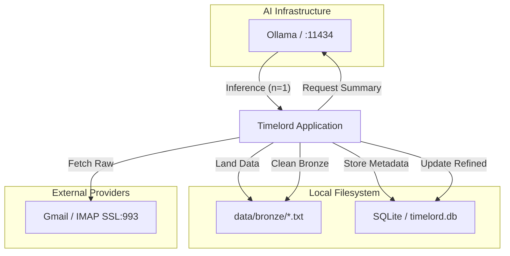

# Operations Runbook: Inbox Intelligence

SRE & Ops guide for maintaining the email summarization pipeline.

## 1. Visual Topology
The system is as a **Spring Modulith** application interacting with local storage and the **Ollama** AI service.

## 2. Configuration
| Setting | Description | Default | Environment Variable |
| :--- | :--- | :--- | :--- |
| `spring.ai.ollama.base-url` | REST API endpoint for Ollama. | `http://localhost:11434` | `OLLAMA_HOST` |
| `spring.ai.ollama.chat.options.model` | Target AI model. | `qwen2.5:7b` | `OLLAMA_MODEL` |
| `spring.ai.ollama.chat.options.timeout` | inference call timeout. | `PT180S` | `OLLAMA_TIMEOUT` |
| `fixedDelay` (Scheduled) | Polling frequency for Silver refinement. | `5000` (ms) | N/A |

### Model Requirements
Ensure the target model is pre-loaded:
`ollama pull qwen2.5:7b`

## 3. Observability & Health
Monitor the following indicators to ensure the **Medallion Architecture** is healthy.

### Logs to Monitor
- `Account {email}: Fetched {n} new emails.` (Inbound Traffic)
- `Processing AI Summary for: {subject}` (Inference Activity)
- `RECOVERY: Checking for PENDING emails...` (Startup Resilience)

### Metrics & Database Checks
- **Backlog Count:** `SELECT count(*) FROM email_payloads WHERE status = 'PENDING';` (Should decrease over time).
- **Failure Rate:** `SELECT count(*) FROM email_payloads WHERE status = 'FAILED';` (Alert if > 5%).
- **Bronze Storage Growth:** Monitor `data/bronze/` disk usage. If files persist, the refinement step is stalled.

## 4. AI Incident Response
Procedures for common failure modes.

### Scenario A: Ollama Service Down
**Symptoms:** 
- `ConnectException` in logs. 
- All intelligence processing stops. 
- `data/bronze` remains full.
**Response:**
1. Restart Ollama: `brew services restart ollama` or equivalent.
2. Verify: `curl http://localhost:11434/api/tags`.
3. The app's **Polling Mechanism** will automatically resume processing `PENDING` payloads.

### Scenario B: AI Model Hallucination
**Symptoms:** 
- `EmailSummaryGeneratedEvent` payloads contain nonsense or unrelated text.
**Response:**
1. Check the model version: `ollama list`.
2. Re-pull the stable model: `ollama pull qwen2.5:7b`.
3. If critical, stop the app and manually mark problematic payloads as `FAILED` to prevent further broadcast.

### Scenario C: SQLite Locking / DB Busy
**Symptoms:** 
- `SQLITE_BUSY` errors.
**Response:**
1. This usually indicates the **Ollama Concurrency Limit (n=1)** has been bypassed.
2. Verify the `Semaphore` in `IntelligenceAdapter.java` is active.
3. Ensure the app is NOT running multiple replicas on the same SQLite file.

---

