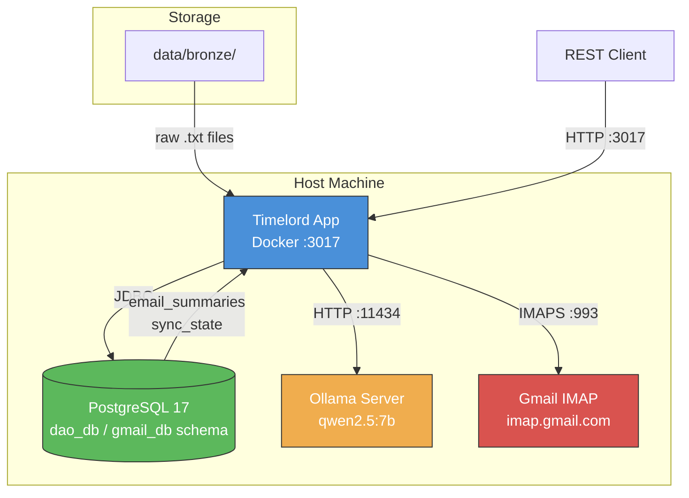
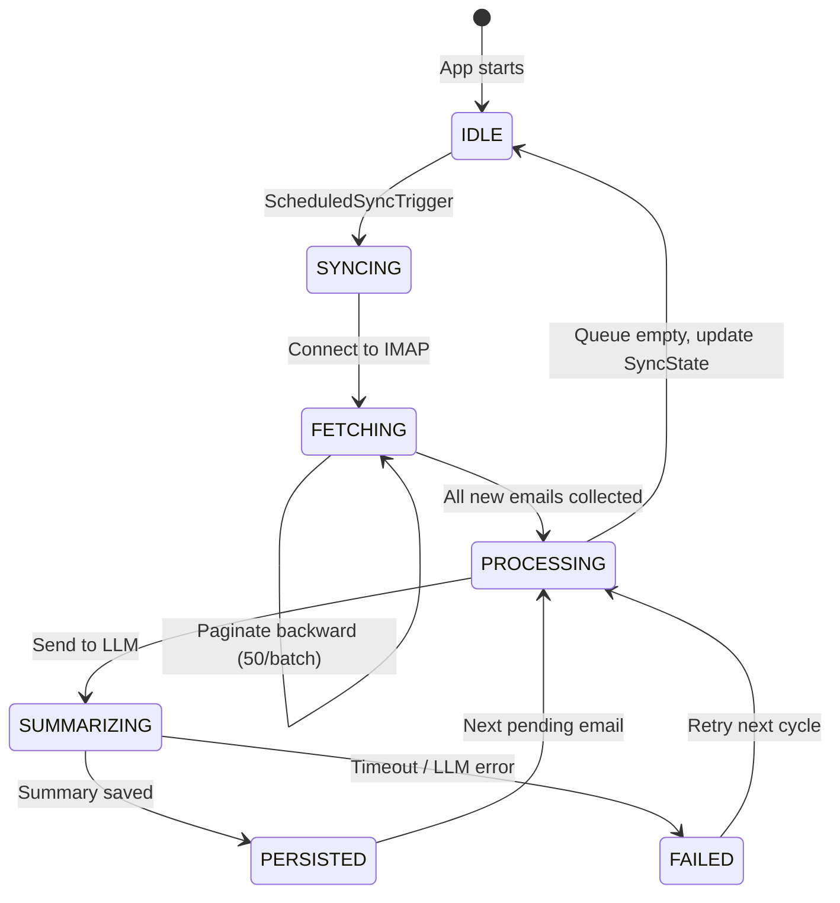

# Inbox Intelligence — Operations Runbook

## Visual Topology

### Deployment Architecture



### Email Processing State Machine



---

## Configuration

### Environment Variables

| Variable | Default | Required | Description |
| :--- | :--- | :--- | :--- |
| `DB_HOST` | `localhost` | Yes | PostgreSQL hostname |
| `DB_NAME` | `timelord` | Yes | Database name |
| `DB_SCHEMA` | `public` | Yes | Schema name (use `gmail_db` in production) |
| `DB_USER` | `postgres` | Yes | Database username |
| `DB_PASSWORD` | *(empty)* | Yes | Database password |

### Application Properties

| Property | Default | Description |
| :--- | :--- | :--- |
| `spring.ai.ollama.base-url` | `http://localhost:11434` | Ollama API endpoint |
| `spring.ai.ollama.chat.options.model` | `qwen2.5:7b` | LLM model identifier |
| `spring.ai.ollama.chat.options.temperature` | `0.4` | Model creativity (lower = more deterministic) |
| `spring.ai.ollama.chat.options.timeout` | `PT3M` | Per-inference timeout (ISO 8601 duration) |
| `inbox.sync-rate-ms` | `3600000` | Sync interval in milliseconds (1 hour) |
| `inbox.cron` | `0 0 * * * *` | Cron expression for periodic sync |

### Email Account Registration

Email accounts are registered in the `sync_state` table. Each row represents one monitored Gmail account with its own sync cursor:

```sql
SELECT email_address, account_name, last_successful_sync_at, total_processed_count
FROM gmail_db.sync_state;
```

---

## Observability

### Key Log Markers

Monitor these log patterns in your log aggregator (ELK, Loki, CloudWatch):

| Log Pattern | Severity | Meaning |
| :--- | :--- | :--- |
| `STARTUP-TRIGGER: Initiating initial inbox synchronization` | INFO | App started, first sync begins |
| `AUTO-TRIGGER: Initiating periodic inbox synchronization` | INFO | Hourly cron sync started |
| `Fetching emails for {email} since {timestamp}` | INFO | IMAP fetch started for an account |
| `Connected to IMAP for {email}` | INFO | IMAP connection successful |
| `Found {n} messages since {timestamp}` | INFO | Batch fetch complete |
| `All {n} emails in batch are new, paginating backward` | INFO | Backward pagination activated |
| `AI summary generated for gmailId={id}` | INFO | Successful LLM summarization |
| `AI inference timeout` | WARN | LLM exceeded 180s timeout |
| `Failed to connect to IMAP` | ERROR | Gmail connection failure |
| `Ollama endpoint unreachable` | ERROR | LLM provider is down |

### Spring Application Events to Monitor

| Event Class | Published When | Action |
| :--- | :--- | :--- |
| `ScheduledSyncTrigger` | Sync cycle begins | Expect IMAP connections shortly after |
| `EmailSummaryGeneratedEvent` | Summary successfully persisted | Normal operation indicator |
| `ProcessingFailedEvent` | LLM or extraction failed | Investigate; may need manual retry |

### Health Check Endpoints

| Endpoint | Purpose |
| :--- | :--- |
| `GET /api/v1/inbox/sync-state` | Verify sync is progressing (check `lastSuccessfulSyncAt`) |
| `GET /api/v1/inbox/feed` | Check if new summaries are available to consumers |
| `GET /actuator/health` | Standard Spring Boot health check |

---

## AI Incident Response

### Scenario 1: Ollama/LLM Provider Down

**Symptoms:** `Ollama endpoint unreachable` errors in logs, `ProcessingFailedEvent` events increasing.

**Steps:**
1. **Verify Ollama status:**
   ```bash
   curl -s http://localhost:11434/api/tags | jq .
   ```
2. **Restart Ollama if needed:**
   ```bash
   systemctl restart ollama
   # or on macOS:
   brew services restart ollama
   ```
3. **Verify model is loaded:**
   ```bash
   ollama list | grep qwen2.5:7b
   ```
4. **If model is missing, pull it:**
   ```bash
   ollama pull qwen2.5:7b
   ```
5. **Trigger a manual re-sync** to process any emails that failed during the outage:
   ```bash
   curl -X POST http://localhost:3017/api/v1/inbox/sync
   ```

**Impact:** Emails are still fetched and saved to the Bronze layer. Summaries will be generated on the next successful sync cycle. No data loss occurs.

### Scenario 2: LLM Rate Limits / Slow Responses

**Symptoms:** `AI inference timeout` warnings, processing queue growing, `lastSuccessfulSyncAt` stale.

**Steps:**
1. **Check system resources** — Local Ollama is CPU/GPU bound:
   ```bash
   top -l 1 | grep ollama
   nvidia-smi  # if GPU available
   ```
2. **Reduce model load** by switching to a smaller model:
   ```properties
   # In application.properties
   spring.ai.ollama.chat.options.model=qwen2.5:3b
   ```
3. **Increase timeout** if resources allow:
   ```properties
   spring.ai.ollama.chat.options.timeout=PT5M
   ```
4. **Restart the application** to pick up config changes.

### Scenario 3: LLM Hallucination / Poor Quality Summaries

**Symptoms:** Summaries contain fabricated information, incorrect dates, or hallucinated senders.

**Steps:**
1. **Lower the temperature** for more deterministic output:
   ```properties
   spring.ai.ollama.chat.options.temperature=0.2
   ```
2. **Review the prompt template** in `IntelligenceAdapter.java` — ensure it contains strong grounding instructions.
3. **Spot-check summaries** via the API:
   ```bash
   curl http://localhost:3017/api/v1/inbox/summaries/{gmailId} | jq .
   ```
4. **Consider upgrading the model** to a larger variant for better accuracy:
   ```properties
   spring.ai.ollama.chat.options.model=qwen2.5:14b
   ```

### Scenario 4: IMAP Connection Failures

**Symptoms:** `Failed to connect to IMAP` errors, sync state not advancing.

**Steps:**
1. **Verify Gmail App Password** is still valid (Google may revoke them).
2. **Check network connectivity:**
   ```bash
   openssl s_client -connect imap.gmail.com:993 -brief
   ```
3. **Verify IMAP is enabled** in Gmail settings (Settings → See all settings → Forwarding and POP/IMAP → Enable IMAP).
4. **Check for Google account security alerts** — Google may block "less secure" sign-ins.

### Emergency: Disable AI Processing Entirely

If the AI is causing production issues and you need to disable summarization without stopping email sync:

1. **Stop the application:**
   ```bash
   docker stop timelord
   ```
2. **Set the Ollama URL to an unreachable endpoint** to gracefully fail AI calls:
   ```bash
   docker run -e SPRING_AI_OLLAMA_BASE_URL=http://0.0.0.0:1 ...
   ```
3. Emails will still be fetched to Bronze but no summaries will be generated. Summaries will be produced when the AI provider is restored and a manual sync is triggered.

---

## Module Canvas


