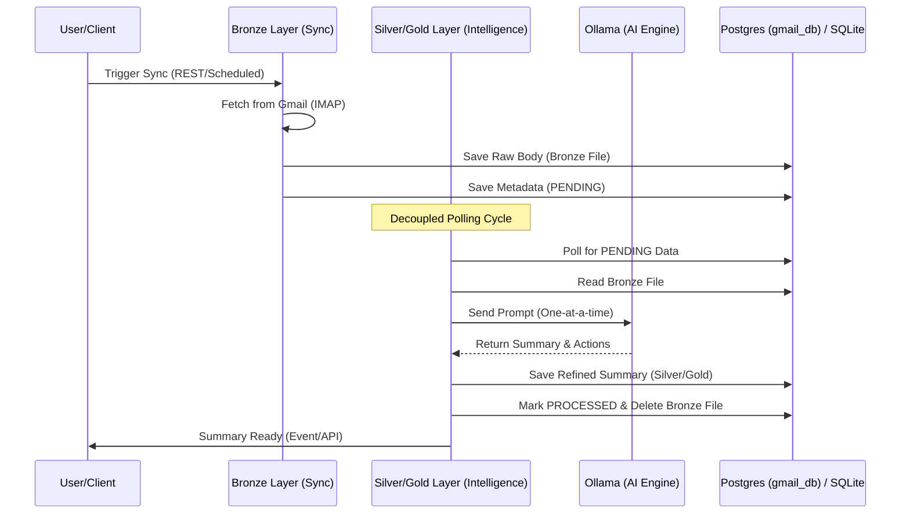

# User & Integration Guide: Inbox Intelligence

Automating email insights and summarization using local AI.

## 1. Overview
The **Inbox Intelligence** module transforms high-volume Gmail inboxes into structured, actionable knowledge. By leveraging local Large Language Models (LLMs), it automatically analyzes incoming emails, extracts key action items, and identifies sentiment—all without sending sensitive data to external SaaS providers.

**Core Value:**
- **Automated Triage:** Instantly understand the "Why" and "What Next" of every email.
- **Privacy-First:** All summarization happens locally via Ollama.
- **Multi-Account Support:** Monitor multiple professional and personal inboxes from a single interface.

## 2. Visual Architecture
The following diagram illustrates how your data flows from your Gmail inbox through our **Medallion Architecture** to the final refined summary.



## 3. How It Works
1.  **Bronze Ingestion (Syncing):** The module connects to your Gmail via IMAP and downloads "Bronze" (raw) versions of new emails as local text files. This ensures no data is lost even if the AI engine is temporarily busy.
2.  **Silver Refinement (AI Analysis):** A background worker independently polls for these raw files. It feeds them to the **Ollama** engine sequentially to ensure your local computer's resources are managed efficiently.
3.  **Gold Delivery (Insights):** Once summarized, the AI-generated insights are stored permanently in the database, and the temporary "Bronze" file is deleted to keep your storage clean.

## 4. Integration Details

### REST API Endpoints
| Endpoint | Method | Description |
| :--- | :--- | :--- |
| `/api/v1/inbox/sync` | `POST` | Manually trigger a fresh sync from Gmail. |
| `/api/v1/inbox/summaries/{gmailId}` | `GET` | Retrieve the specific summary for an email. |
| `/api/v1/inbox/sync-state` | `GET` | Check the current health and count for each account. |

### Sample Refined Summary (JSON)
```json
{
  "summaryId": "uuid-1234-5678",
  "originalGmailId": "<message-id@gmail.com>",
  "sourceEmail": "user@example.com",
  "summaryText": "The Q1 strategy meeting has been moved to Thursday at 10 AM.",
  "keyActionItems": [
    "Confirm attendance for Thursday",
    "Update the slide deck by Wednesday EOD"
  ],
  "sentiment": "NEUTRAL",
  "processedAt": "2026-04-02T10:00:00"
}
```

## 5. Domain Events
Integrators can listen for these Spring Application Events:
- `EmailSummaryGeneratedEvent`: Fired when a new Silver/Gold summary is ready.
- `ProcessingFailedEvent`: Fired if an email couldn't be summarized (e.g., body was too complex or AI timed out).

## 6. Known Limitations
- **Model Capacity:** We use local models (default: `qwen2.5:7b`). Very large emails (>4,000 characters) are truncated to ensure consistent performance.
- **Sequential Processing:** To protect your hardware, only one email is summarized at a time. High-volume inboxes may experience a "refinement lag" during the initial sync.

---

