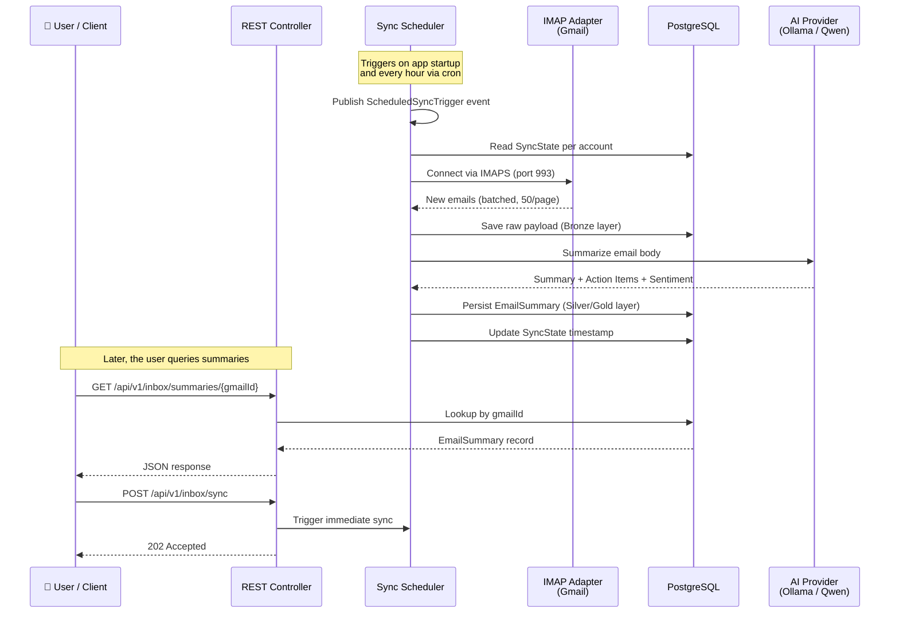

# Inbox Intelligence — User & Integration Guide

## Overview

**Inbox Intelligence** is an automated email awareness feature for the Timelord platform. It continuously monitors your Gmail accounts, reads incoming messages, and produces concise, actionable summaries — so you never miss an important deadline, invoice, or follow-up buried in your inbox.

**What problem does it solve?**  
Modern knowledge workers receive hundreds of emails daily. Important action items get lost in noise. Inbox Intelligence acts as a personal assistant that reads every email, distills each one into a brief summary with key action items and sentiment, and stores those insights for instant retrieval — all without you ever opening Gmail.

**Key capabilities:**
- 🔄 **Multi-account support** — Monitor multiple Gmail inboxes simultaneously
- 🧠 **AI-powered summarization** — Each email is analyzed by a local LLM for summary, action items, and sentiment
- 📊 **Searchable summaries** — Query any processed email's summary via a simple REST API
- ⏱️ **Delta sync** — Only new messages are processed; the system remembers where it left off per account

---

## Visual Architecture

The following diagram illustrates the end-to-end flow from email arrival to summary retrieval:



---

## How It Works

1. **Periodic Polling** — On application startup (and every hour thereafter), the system triggers a sync cycle for every registered Gmail account.
2. **Batched Fetching** — The IMAP adapter connects to Gmail via SSL on port 993, fetches emails in batches of 50, and uses backward-pagination to ensure no messages are missed — even during extended downtime.
3. **Bronze Landing** — Each raw email body is saved as a `.txt` file in `data/bronze/` and its metadata is recorded in the database with a `PENDING` status.
4. **AI Summarization** — A local LLM (Qwen 2.5:7b via Ollama) processes each pending email, extracting a concise summary, key action items, and overall sentiment.
5. **Summary Persistence** — The refined summary is stored in the `email_summaries` table, and the sync state timestamp is advanced.

---

## Integration Details

### REST API Endpoints

| Endpoint | Method | Purpose |
| :--- | :--- | :--- |
| `/api/v1/inbox/sync-state` | `GET` | Retrieve sync status for all accounts |
| `/api/v1/inbox/sync` | `POST` | Manually trigger a sync cycle |
| `/api/v1/inbox/summaries/{gmailId}` | `GET` | Retrieve the AI summary for a specific email |
| `/api/v1/inbox/feed` | `GET` | Load summaries newer than a cursor `since` |
| `/api/v1/inbox/emails/{gmailId}` | `GET` | Retrieve the full original email detail |
| `/api/v1/inbox/emails/{gmailId}/reply` | `POST` | Send a reply to an email thread via SMTP |

### Sample: Get Summary Feed

**Request:**
```http
GET /api/v1/inbox/feed?since=2026-04-06T09:00:00&limit=1 HTTP/1.1
Host: localhost:3017
```

**Response (200 OK):**
```json
{
  "summaries": [
    {
      "summaryId": "a1b2c3d4-e5f6-7890-abcd-ef1234567890",
      "originalGmailId": "msg-abc123",
      "sourceEmail": "keping.bi@gmail.com",
      "sender": "example@domain.com",
      "subject": "Project Update",
      "receivedAt": "2026-04-06T09:12:00",
      "summaryText": "The Q1 release timeline has been shifted to Friday.",
      "keyActionItems": ["Update configuration files."],
      "sentiment": "NEUTRAL",
      "processedAt": "2026-04-06T09:15:00"
    }
  ],
  "nextCursor": "2026-04-06T09:12:00",
  "hasMore": false
}
```

### Sample: Reply to Email

**Request:**
```http
POST /api/v1/inbox/emails/msg-abc123/reply HTTP/1.1
Host: localhost:3017
Content-Type: application/json

{
  "gmailId": "msg-abc123",
  "body": "Got it, I will update the configs.",
  "replyAll": false
}
```

**Response (200 OK):**
```json
{
  "originalGmailId": "msg-abc123",
  "sourceEmail": "keping.bi@gmail.com",
  "replyMessageId": "<new-id@mail.gmail.com>",
  "sentAt": "2026-04-06T10:30:00"
}
```

### Domain Events


Other modules within the Timelord ecosystem can listen for these Spring Application Events:

| Event | When It Fires | Payload |
| :--- | :--- | :--- |
| `EmailSummaryGeneratedEvent` | After a summary is persisted | `EmailSummary` record |
| `ProcessingFailedEvent` | If LLM or extraction fails | Reason code + Message ID |

---

## Module Canvas

The following diagram is auto-generated by Spring Modulith and shows the `inbox` module's dependency graph:


---

## Known Limitations

| Limitation | Explanation |
| :--- | :--- |
| **One email at a time** | The AI processes emails sequentially (single concurrency) to avoid overloading local hardware. During high-volume syncs, processing may take several minutes. |
| **180-second timeout** | If the AI model takes longer than 3 minutes to summarize a single email, the request is cancelled to prevent thread hangs. |
| **No OAuth2** | Authentication uses Google App Passwords over IMAP — no browser-based OAuth flow is required, but App Passwords must be configured manually per account. |
| **Attachment support is limited** | Currently, only text-based attachments are extracted. Binary formats (images, videos) are noted but not analyzed. |
| **Summaries are not editable** | Once generated, summaries are immutable. If the AI produces a poor summary, the email must be re-processed. |
| **Local model quality** | The 7B-parameter Qwen model provides good general summaries but may miss nuance in highly technical or domain-specific emails. |
