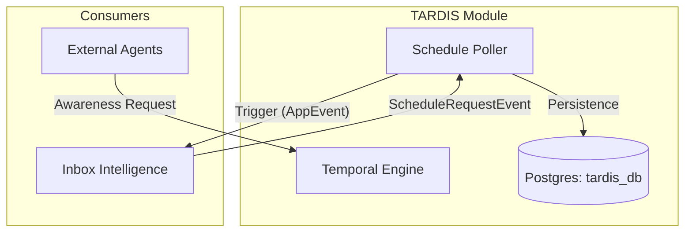

# 🪐 TARDIS Usage Guide

The **TARDIS (Time and Relative Dimension in Space) Service** provides high-precision temporal intelligence and subjective self-awareness to the Timelord ecosystem.

## 🕰️ Core Features

### 1. Entity Self-Awareness
TARDIS tracks the "temporal feeling" of entities. For a `PERSON`, it calculates life stages based on a normalized 80-year span:
- **`YOUNG`**: < 25 years
- **`MIDDLE_AGED`**: 25 - 60 years
- **`OLD`**: > 60 years

### 2. Circadian Context
TARDIS reports whether an Earth-based entity is currently experiencing **Daylight** (06:00 - 18:00) based on their registered timezone.

### 3. Email Chain Timeline
Provides deep analysis of message chains, calculating average response times and chronological point-mapping.

---

## 📡 API Integration

### Get Awareness for an Entity
**Endpoint:** `POST /api/v1/tardis/awareness`
**Payload:**
```json
{
  "entityId": "user-123",
  "type": "PERSON",
  "timezone": "America/New_York",
  "birthTimestamp": "1995-10-15T08:00:00",
  "sourceConfidence": "HIGHEST"
}
```

### Register a Future Schedule
**Endpoint:** `POST /api/v1/tardis/schedules`
**Payload:**
```json
{
  "scheduleId": "sync-task-456",
  "ownerModule": "inbox-intelligence",
  "targetTime": "2026-04-03T10:00:00",
  "isPeriodic": false,
  "payloadJson": "{\"action\":\"trigger_summarization\"}"
}
```

---

## 🏗️ Topology


